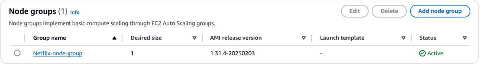

# Netflix CI/CD Pipeline


## Introduction
This project implements a Netflix application with a CI/CD pipeline on Jenkins, using SonarQube to scan the source code, Trivy to scan Docker images, Terraform to deploy AWS EKS, and ArgoCD to deploy to AWS EKS. The project also includes monitoring Jenkins and AWS EKS using Prometheus and Grafana.

## Technologies Used
- **Docker**: For building and managing images.
- **Jenkins**: For implementing the CI/CD pipeline.
- **SonarQube**: For scanning the source code.
- **Trivy**: For scanning Docker images.
- **Terraform**: For creating the AWS EKS cluster.
- **ArgoCD**: For deploying applications to EKS.
- **Prometheus & Grafana**: For monitoring Jenkins.
- **Helm**: For installing Prometheus and Grafana to monitor AWS EKS.


<div align="center">
  
  <br>
  <a href="http://netflix-clone-with-tmdb-using-react-mui.vercel.app/">
    
  </a>
</div>
<br />
<div align="center">
  
  <p align="center">Home Page</p>
</div>


### **CI/CD Pipeline in Jenkins**

**Jenkins Pipeline Stage View:**

<div align="center">
  
</div>

**Configure CI/CD Pipeline in Jenkins:**

```groovy
pipeline{
    agent any
    tools{
        jdk 'jdk17'
        nodejs 'node16'
    }
    environment {
        SCANNER_HOME=tool 'sonar-scanner'
    }
    stages {
        stage('clean workspace'){
            steps{
                cleanWs()
            }
        }
        stage('Checkout from Git'){
            steps{
                git branch: 'main', url: 'https://github.com/thaihung202/Netflix-app.git'
            }
        }
        stage("Sonarqube Analysis "){
            steps{
                withSonarQubeEnv('sonar-server') {
                    sh ''' $SCANNER_HOME/bin/sonar-scanner -Dsonar.projectName=Netflix \
                    -Dsonar.projectKey=Netflix '''
                }
            }
        }
        stage("quality gate"){
           steps {
                script {
                    waitForQualityGate abortPipeline: false, credentialsId: 'Sonar-token' 
                }
            } 
        }
        stage('Install Dependencies') {
            steps {
                sh "npm install"
            }
        }
        stage('OWASP FS SCAN') {
            steps {
                dependencyCheck additionalArguments: '--scan ./ --disableYarnAudit --disableNodeAudit', odcInstallation: 'DP-Check'
                dependencyCheckPublisher pattern: '**/dependency-check-report.xml'
            }
        }
        stage('TRIVY FS SCAN') {
            steps {
                sh "trivy fs . > trivyfs.txt"
            }
        }
        stage("Docker Build & Push"){
            steps{
                script{
                   withDockerRegistry(credentialsId: 'docker', toolName: 'docker'){   
                       sh "docker build --build-arg TMDB_V3_API_KEY=ca6f43766177fa6af9a187521136e4e3 -t netflix ."
                       sh "docker tag netflix thaihung17/netflix:latest "
                       sh "docker push thaihung17/netflix:latest "
                    }
                }
            }
        }
        stage("TRIVY"){
            steps{
                sh "trivy image thaihung17/netflix:latest > trivyimage.txt" 
            }
        }
        stage('Deploy to container'){
            steps{
                sh 'docker run -d -p 8081:80 thaihung17/netflix:latest'
            }
        }
    }
    post {
     always {
        emailext attachLog: true,
            subject: "'${currentBuild.result}'",
            body: "Project: ${env.JOB_NAME}<br/>" +
                "Build Number: ${env.BUILD_NUMBER}<br/>" +
                "URL: ${env.BUILD_URL}<br/>",
            to: 'thaihung17122003@gmail.com',                                
            attachmentsPattern: 'trivyfs.txt,trivyimage.txt'
        }
    }
}
```
**Plugins in Jenkins:**

1 Eclipse Temurin Installer 

2 SonarQube Scanner 

3 NodeJs Plugin

4 Email Extension Plugin

5 Prometheus Metrics

6 Pineline: REST API

7 Pineline: Stage View

8 OWASP Dependency-Check

9 Docker 

10 Docker API

11 Docker Pineline

12 Docker Commons

13 Maven Intergration

### **SonarQube and Trivy on the EC2 instance to scan for vulnerabilities**

<div align="center">
  
</div>

### **Create EKS Cluster with terraform**

<div align="center">
  
</div>

<div align="center">
  
</div>

### **Deploy Application with ArgoCD**

<div align="center">
  
</div>

### **Monitoring with prometheus and grafana**

<div align="center">
  
</div>

<div align="center">
  
</div>

### **Send Notification to email**

<div align="center">
  
</div>
